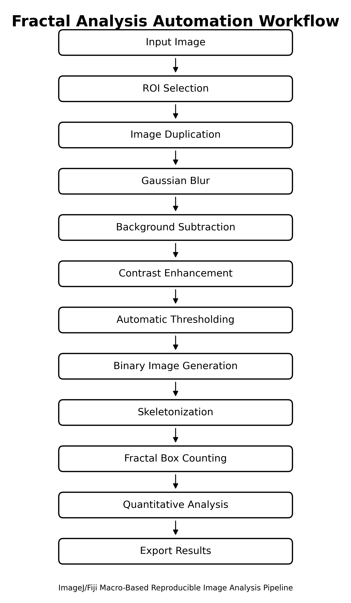

# Fractal Analysis Automation for ImageJ

[](https://imagej.net/)
[]()
[](LICENSE)
[]()

Automated ImageJ/Fiji macro for fractal dimension analysis and image-based quantitative morphology assessment.

This repository provides a reproducible workflow for preprocessing images, generating binary and skeletonized outputs, and performing fractal box-counting analysis.

---

## Overview

Fractal analysis is widely used to quantify complex structural patterns in biological, medical, dental, histological, microscopic, and material images.

This ImageJ macro was developed to automate repetitive image-processing steps and standardize fractal dimension analysis workflows.

The macro can be adapted for different image-based research applications, including:

- trabecular bone pattern analysis
- dental and panoramic radiograph analysis
- microscopic image analysis
- histological image assessment
- porous material structure analysis
- general morphology and texture analysis

---

## Key Features

- Automated image preprocessing
- ROI-based analysis workflow
- Gaussian blur filtering
- Background subtraction
- Contrast enhancement
- Automatic thresholding
- Binary image generation
- Skeletonization
- Fractal dimension analysis using box counting
- Quantitative morphology assessment
- Export of processed images and analysis results



---

## Repository Structure

```text
fractal-analysis-automation-ImageJ
│
├── macro
│   └── fractal_analysis_automation.ijm
│
├── docs
│
├── images
│
├── example_input
│
├── example_output
│
├── publications
│
├── CITATION.cff
├── CHANGELOG.md
├── CONTRIBUTING.md
├── README.md
└── LICENSE

---

## Requirements

- Fiji / ImageJ (recommended)
- ImageJ Macro Language
- Analyze Skeleton plugin (if required)

---

## Installation

1. Clone or download this repository.
2. Open Fiji/ImageJ.
3. Navigate to:

Plugins → Macros → Run...

4. Select:

macro/fractal_analysis_automation.ijm

5. Execute the macro.

---


## General Workflow

Input Image

↓

ROI Selection

↓

Preprocessing

↓

Background Subtraction

↓

Thresholding

↓

Binary Conversion

↓

Skeletonization

↓

Fractal Dimension Analysis

↓

Export Results

---

## Applications

This workflow can be adapted for:

- Dental radiographs
- Trabecular bone analysis
- Histological images
- Microscopy
- Material science
- Biological image analysis

---

## Author

**Mehmet Ihsan Oztoprak**

Department of Bioengineering

Marmara University

---

## License

MIT License